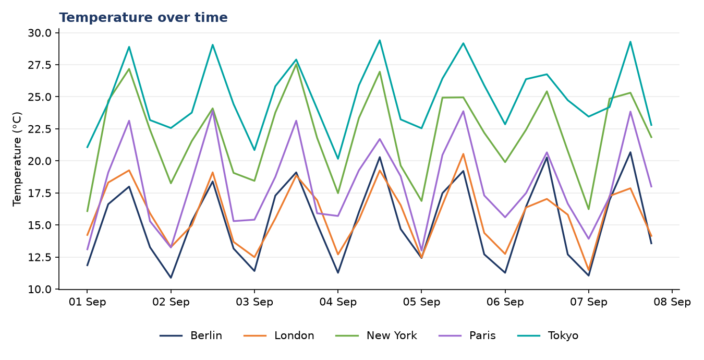
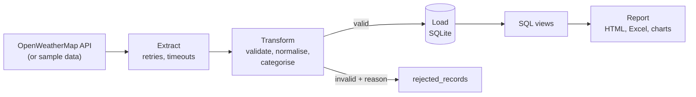
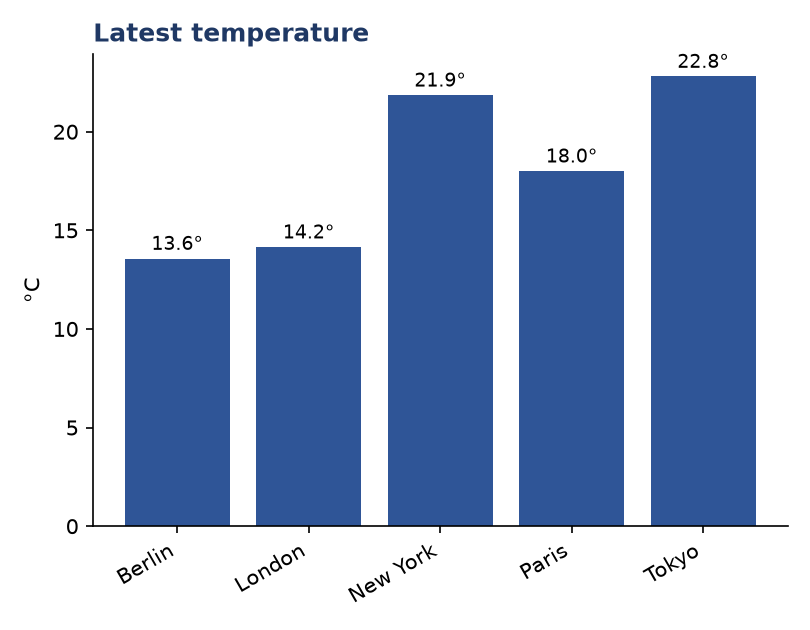
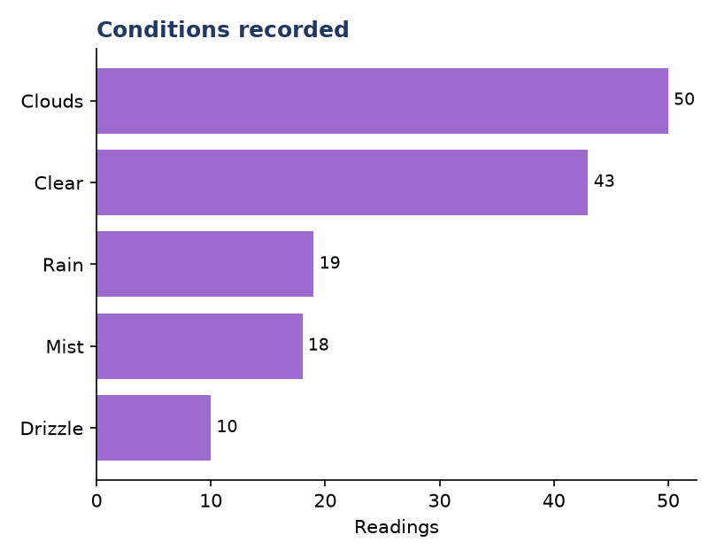

# Weather Data ETL Pipeline


A small but complete data pipeline. It pulls current weather for a list of cities
from the OpenWeatherMap API, checks every reading, stores the good ones in a SQL
database, and produces an HTML report, an Excel file and charts.

It works with no API key and no database server. Without a key it runs on
generated sample data that has the same shape as the real API response. With a
free key it collects real readings, and you can schedule it to build up history.

The sample data is generated, so those numbers are not real weather.



## Why I built it this way

The first version of this project needed a running MySQL server and my own API
key, so nobody else could run it, and one bad API response could stop the whole
run. I rebuilt it with the things a pipeline needs when it runs unattended:

- **It retries.** Timeouts, connection errors, HTTP 429 and 5xx responses are
  retried with a growing wait. A wrong key (401) or an unknown city (404) is not
  retried, because retrying can't fix it.
- **One bad city never stops the others.** Failures are collected and reported.
- **Every reading is checked.** A temperature of 900 degrees, humidity of 140% or
  negative wind speed is rejected with a reason and stored in a `rejected_records`
  table. It doesn't reach the charts.
- **Running it twice is safe.** A `UNIQUE (city, observed_at)` constraint means the
  same reading can only be stored once. The second run reports "0 new, 140 already
  stored".
- **The database checks too.** `CHECK` constraints refuse impossible values even if
  the validation step were skipped.
- **The key never touches the code.** It comes from the environment or a local
  `.env` file, which is git-ignored.

## How it works



| Step | What it does | File |
|---|---|---|
| Extract | Calls the API for each city with a timeout and retries, or generates sample readings | `weather_etl/extract.py`, `sample_data.py` |
| Transform | Checks fields and ranges, converts the timestamp to UTC, adds a temperature and a wind category | `weather_etl/transform.py` |
| Load | Inserts into SQLite, ignores readings already stored, records rejects and a run log | `weather_etl/load.py`, `sql/schema.sql` |
| Report | Reads the database views and writes charts, an HTML page and an Excel workbook | `weather_etl/report.py` |

The database has three tables (`weather_observations`, `rejected_records`,
`pipeline_runs`) and two views. `v_latest_by_city` uses a window function
(`ROW_NUMBER() OVER (PARTITION BY city ...)`) to get each city's newest reading.

## Running it

```bash
pip install -r requirements.txt
python run_pipeline.py --source sample     # no key needed
python -m pytest tests -q                  # 19 tests, no network needed
```

For real readings, get a free key from [openweathermap.org](https://openweathermap.org/api),
copy `.env.example` to `.env`, put the key in it, then:

```bash
python run_pipeline.py --source live
python run_pipeline.py --cities London Rome Karachi
```

Everything lands in the `output` folder: `weather_report.html`, `weather_data.xlsx`,
three PNG charts and the SQLite database `weather.db`.

### Collecting history automatically (Windows)

`scripts/daily_weather.bat` runs the pipeline once. Point Windows Task Scheduler at
it (daily, or every few hours) and the database builds up a real time series. Because
loading is safe to repeat, an extra run never creates duplicates.

## What it produces

 

The Excel file has three sheets (city summary, latest reading per city, full
history). The HTML report puts the same information on one page.

## Limits

- The free OpenWeatherMap plan allows about 60 calls a minute, which is plenty for
  a handful of cities. Hundreds of cities would need pacing.
- SQLite is right for one user or one scheduled job. Several writers at once would
  need a server database such as PostgreSQL. Only the load step would change.
- Sample mode is for demonstration. The "history" it creates is generated.
- Readings are stored in UTC. Local times would be a display change in the report.

## Layout

```
run_pipeline.py            entry point and command-line options
weather_etl/
  config.py                cities, limits, retry settings (no secrets)
  extract.py  sample_data.py  transform.py  load.py  report.py
sql/schema.sql             tables, constraints, views
templates/report.html.j2   HTML report template
scripts/daily_weather.bat  for Windows Task Scheduler
tests/test_pipeline.py     19 tests using a fake API
output/                    a sample report (database is not committed)
```

Built with Python (requests, pandas, matplotlib, openpyxl, Jinja2), SQL (SQLite) and pytest.

## Contact

Muhammad Adnan, [LinkedIn](https://linkedin.com/in/muhammad-adnan-740336293),
adnandanish0404@gmail.com
